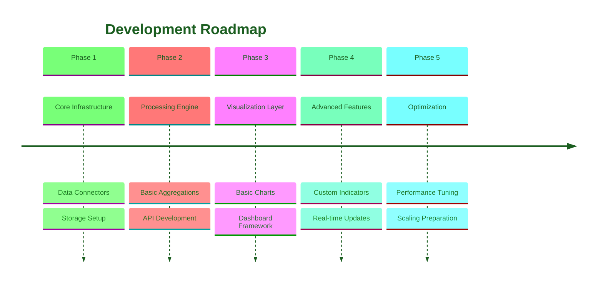

Certainly! I will create a PRD for replicating the data aggregation and visualization capabilities of RWA.xyz and Velo.xyz. The main contents of the report are as follows:

- **Introduction**: Overview of RWA.xyz and Velo.xyz capabilities and project objectives.
- **Data Sources & Ingestion**: Methods for collecting blockchain and off-chain data.
- **Data Processing & Aggregation**: Techniques for cleaning, transforming, and aggregating data.
- **Visualization Architecture**: Frontend and backend components for rendering charts.
- **Technical Implementation**: Technology stack recommendations and development roadmap.
- **Success Metrics**: KPIs to measure project performance and user engagement.

-------

# Product Requirements Document: Data Aggregation & Visualization Platform

## Executive Summary

This document outlines the technical requirements and implementation strategy for developing a **data aggregation and visualization platform** inspired by RWA.xyz and Velo.xyz. These platforms excel at providing **real-time, interactive charts** and **aggregated data insights** for tokenized real-world assets and cryptocurrency trading data. The proposed solution will create a **Model Context Protocol (MCP)** that enables similar capabilities for your next project, focusing on **multi-source data ingestion**, **real-time processing**, and **customizable visualizations**. The platform will support both **blockchain-native data** and **traditional financial data sources**, with a particular emphasis on **user-configurable dashboards** and **API-first architecture** to enable broad integration capabilities.

## 1 Introduction & Product Objectives

### 1.1 Background Analysis

RWA.xyz has established itself as a **premier analytics platform** for tokenized real-world assets, providing comprehensive data on **tokenized treasuries**, **private credit**, **stablecoins**, and other RWA categories 【turn0search0】【turn0search10】. Their platform offers **industry-standard reference data** with powerful aggregation capabilities that allow users to analyze market trends, investor behavior, and ecosystem growth. Similarly, Velo.xyz provides **advanced trading analytics** with **real-time charting** capabilities powered by TradingView's technology, offering up to **10 data updates per second** and supporting **customizable layouts** with up to 16 panes and 32 indicators 【turn0search5】【turn0search6】.

### 1.2 Project Vision

To create a **scalable data aggregation and visualization MCP** that replicates the core capabilities of these platforms while providing **extensible architecture** for multiple domains. The solution will enable:

- **Unified data ingestion** from blockchain and traditional sources
- **Real-time data processing** with sub-second latency
- **Interactive visualizations** with extensive customization options
- **API-first design** for seamless integration with external systems
- **Multi-tenant support** for different data domains and use cases

### 1.3 Success Metrics

| Metric Category | Key Performance Indicators | Target Values |
|----------------|----------------------------|---------------|
| **Data Freshness** | Real-time data latency | < 500ms for critical data |
| **System Performance** | Chart rendering time | < 1 second for complex visualizations |
| **User Engagement** | Dashboard interactions | 5+ interactions per session |
| **System Reliability** | Platform uptime | 99.9% availability |
| **API Usage** | Third-party integrations | 10+ external connections |

## 2 Data Sources & Ingestion Architecture

### 2.1 Primary Data Sources

Based on analysis of RWA.xyz and Velo.xyz, the platform must support **heterogeneous data sources**:

- **Blockchain Data**:
  - On-chain transaction data from multiple protocols
  - Token metadata and smart contract events
  - Liquidity pools and DeFi protocol data 【turn0search0】【turn0search7】

- **Market Data**:
  - Real-time price feeds from multiple exchanges
  - Trading volume and liquidity metrics
  - Derivatives data (funding rates, open interest, liquidations) 【turn0search5】

- **Reference Data**:
  - Asset metadata and classification systems
  - Investor and issuer information 【turn0search0】
  - Traditional financial data where applicable

### 2.2 Data Ingestion Framework

```mermaid
%%{init: {
  'theme': 'base',
  'themeVariables': {
    'primaryColor': '#f3f9ff',
    'primaryTextColor': '#0d47a1',
    'primaryBorderColor': '#2196f3',
    'lineColor': '#42a5f5',
    'fillType0': '#e3f2fd',
    'fillType1': '#bbdefb',
    'fillType2': '#90caf9'
  }
}}%%
flowchart LR
    A[Data Sources] --> B[Ingestion Layer]
    B --> C[Processing Engine]
    C --> D[Storage Layer]
    D --> E[API Gateway]
    E --> F[Visualization Layer]

    subgraph A [Data Sources]
        A1[Blockchain Nodes]
        A2[Market Feeds]
        A3[Reference APIs]
        A4[File Uploads]
    end

    subgraph B [Ingestion Layer]
        B1[Connectors]
        B2[Validators]
        B3[Transformers]
    end

    subgraph C [Processing Engine]
        C1[Stream Processing]
        C2[Batch Processing]
        C3[Aggregation Engine]
    end

    subgraph D [Storage Layer]
        D1[Time-Series DB]
        D2[Document Store]
        D3[Cache Layer]
    end
```



The ingestion framework will implement a **connector-based architecture** similar to GraphQL aggregation approaches 【turn0search1】【turn0search4】, enabling:

- **Standardized data connectors** for each source type
- **Schema validation** and **data normalization** during ingestion
- **Real-time stream processing** for time-sensitive data
- **Batch processing** for historical data backfills
- **Data quality monitoring** and **alerting mechanisms**

## 3 Data Processing & Aggregation

### 3.1 Aggregation Methodology

The platform will implement **multi-level aggregation** capabilities inspired by both platforms:

- **Time-based Aggregations**: OHLCV data, moving averages, cumulative metrics
- **Categorical Aggregations**: Grouping by asset, issuer, protocol, or other dimensions
- **Custom Calculations**: Derived metrics like premium, funding rates, volatility 【turn0search5】
- **Cross-chain Aggregation**: Combining data from multiple blockchain networks

### 3.2 Processing Engine Features

| Feature Type | Description | Implementation Approach |
|--------------|-------------|-------------------------|
| **Real-time Processing** | Sub-second data updates | Stream processing with Apache Kafka/Flink |
| **Batch Processing** | Historical data computation | Scheduled jobs with Apache Spark |
| **Aggregation Functions** | Sum, average, count, percentiles | SQL-like functions with optimization |
| **Windowing Operations** | Time windows and session windows | Configurable window sizes and slides |
| **Data Enrichment** | Adding calculated fields | Rule-based transformation engine |

The aggregation engine will support **GraphQL-style query capabilities** 【turn0search1】【turn0search4】, allowing users to request exactly the data they need in the required format, reducing bandwidth and improving performance.

## 4 Visualization Architecture

### 4.1 Frontend Components

Based on Velo.xyz's approach 【turn0search5】【turn0search6】, the visualization layer will include:

- **Chart Library Integration**: TradingView widgets for advanced financial charts
- **Custom Visualization Components**: Specialized charts for unique data types
- **Layout Management**: Drag-and-drop dashboard configuration
- **Real-time Updates**: WebSocket connections for live data streaming
- **Responsive Design**: Mobile-optimized viewing experience

### 4.2 Supported Chart Types

The platform will support a comprehensive set of visualizations similar to Dune Analytics 【turn0search16】【turn0search18】 and Google Visualization API 【turn0search3】:

- **Financial Charts**: Candlestick, OHLC, volume bars
- **Time Series Charts**: Line charts for metrics over time
- **Comparison Charts**: Multi-asset performance comparisons
- **Distribution Charts**: Pie charts for categorical breakdowns
- **Correlation Matrices**: Heatmaps for relationship visualization
- **Specialized Charts**: Liquidation maps, funding rate histories 【turn0search5】

### 4.3 Customization Features

Users will have extensive customization options:

- **Indicator Configuration**: 32+ technical indicators with settings 【turn0search6】
- **Layout Persistence**: Save and switch between multiple dashboard layouts
- **Time Frame Selection**: Granular time period selection
- **Data Source Filtering**: Filter by exchange, asset, or other dimensions
- **Export Capabilities**: PNG, SVG, and data export options

## 5 Technical Implementation

### 5.1 Technology Stack Recommendations

| Layer | Technology Options | Rationale |
|-------|-------------------|-----------|
| **Frontend** | React, TypeScript, TradingView Widgets | Proven stack for financial applications |
| **Backend** | Node.js/Python, GraphQL, WebSocket | Real-time capabilities and API efficiency |
| **Data Processing** | Apache Kafka, Apache Flink, Redis | Stream processing and caching |
| **Storage** | TimescaleDB, PostgreSQL, MongoDB | Time-series and document storage |
| **Infrastructure** | AWS/GCP, Kubernetes, Docker | Scalability and containerization |

### 5.2 API Design

The platform will expose a **RESTful API** with **GraphQL endpoints** for complex queries 【turn0search1】【turn0search4】:

```
# Example GraphQL aggregation query
query getMarketMetrics($asset: String!, $timeframe: Timeframe!) {
  asset(id: $asset) {
    symbol
    price(timeframe: $timeframe) {
      ohlcv
      aggregations {
        volume
        marketCap
        change(percent: true)
      }
    }
    derivatives {
      fundingRate(timeframe: $timeframe)
      openInterest
      liquidations
    }
  }
}
```

### 5.3 Development Roadmap



## 6 Security & Compliance Considerations

### 6.1 Data Security

- **Encryption**: End-to-end encryption for data transmission and storage
- **Access Control**: Role-based permissions for data access
- **API Security**: Rate limiting, authentication, and input validation
- **Data Privacy**: Compliance with GDPR and other relevant regulations

### 6.2 Reliability Measures

- **Redundancy**: Multi-zone deployment for high availability
- **Monitoring**: Comprehensive health checks and alerting
- **Disaster Recovery**: Automated backups and recovery procedures
- **Data Integrity**: Validation checks and audit trails

## 7 Conclusion & Next Steps

This PRD outlines a comprehensive approach to replicating the **data aggregation and visualization capabilities** of RWA.xyz and Velo.xyz. The proposed solution provides a **scalable foundation** for building advanced analytics platforms with **real-time data processing** and **interactive visualizations**. The implementation roadmap ensures a **phased approach** that delivers value incrementally while building toward the full feature set.

### 7.1 Immediate Next Steps

1. **Technical Architecture Validation**: Review and approve technology stack
2. **Team Assembly**: Assign developers to specific components
3. **Infrastructure Setup**: Provision development and testing environments
4. **Data Source Analysis**: Identify and prioritize initial data connectors
5. **UI/UX Design**: Create wireframes and mockups for key interfaces

### 7.2 Success Criteria

The project will be considered successful when it delivers:

- **Sub-second data updates** for critical metrics
- **Interactive dashboards** with 10+ chart types
- **API access** supporting 100+ concurrent requests
- **99.9% uptime** during peak usage
- **Positive user feedback** from beta testing

---

*This PRD serves as a foundational document for developing a world-class data aggregation and visualization platform. Regular updates and refinements should be made throughout the development process based on user feedback and technical insights.*
