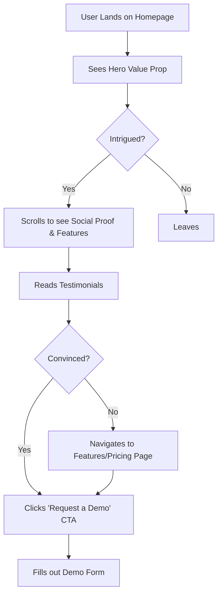

Of course. Here is a Product Requirements Document (PRD) that breaks down the UI/UX patterns of the Conduit Commerce retailers page. This document is designed to serve as a reusable template and a Model Context Protocol (MCP) for building similar professional, conversion-oriented B2B SaaS websites.

---

# **Product Requirements Document: B2B SaaS UI Template**

## 1. Introduction & Vision

### 1.1 Purpose
This document outlines the User Interface (UI) and User Experience (UX) requirements for a B2B SaaS website, using the design patterns and principles observed on `conduitcommerce.com/retailers` as a primary reference. The goal is to create a reusable template and MCP that can be adapted for various B2B products to ensure a professional, trustworthy, and high-converting web presence.

### 1.2 Vision
To create a web UI that effectively communicates value, builds immediate credibility, and guides potential customers toward a conversion action (e.g., requesting a demo) with clarity and efficiency. The design will be clean, modern, and user-centric, prioritizing information accessibility and trust signals over flashy aesthetics.

## 2. User Personas

The UI design must cater to the following primary user personas:

| Persona | Role | Goals | Frustrations |
|---------|------|-------|--------------|
| **The Decision Maker** (e.g., Director of Operations, VP of Retail) | Evaluates and purchases software for their company. | Quickly understand the core value proposition. Verify credibility and trustworthiness. Compare features and pricing. | Vague marketing language. Hard-to-find pricing or contact info. Unprofessional website design. |
| **The End User** (e.g., Store Manager, Logistics Coordinator) | Will use the software daily. | Understand how the tool will make their job easier. See practical benefits and features. Find documentation or support easily. | Complex, jargon-filled explanations. UI that looks powerful but difficult to use. |

## 3. Design Principles & Philosophy

All UI decisions must adhere to the following core principles:

1.  **Clarity Over Cleverness:** Use simple, direct language. Every element should have an obvious purpose. Avoid jargon and ambiguous marketing terms.
2.  **Credibility by Design:** The UI must look professional and trustworthy. This is achieved through clean layouts, high-quality imagery, and prominent display of social proof (client logos, testimonials).
3.  **Guided Conversion:** The user journey should be intentionally designed, leading visitors toward a primary Call-to-Action (CTA) without being pushy. CTAs must be visually distinct and strategically placed.
4.  **Consistency & Predictability:** Use a consistent system for colors, typography, spacing, and component behavior. Users should not have to guess how to interact with an element.
5.  **Efficiency First:** Both the Decision Maker and End User are time-poor. Information must be scannable. Key value propositions should be digestible within 5-10 seconds of landing on a page.

## 4. UI Component Library & Layout System

This section defines the reusable building blocks of the website. These components form the core of the MCP template.

| Component | Description | Purpose | Variations |
|-----------|-------------|---------|------------|
| **Header/Navigation** | Top bar with logo, main navigation links, and a primary CTA button. | Provides consistent site-wide navigation and immediate access to the most important action. | Sticky (remains visible on scroll), transparent with solid background on scroll. |
| **Hero Section** | The top-most section of a page. Features a large H1 headline, a short descriptive paragraph (H2/H3), a primary CTA button, and a relevant background image or graphic. | To communicate the core value proposition in under 5 seconds and capture user interest. | Background image, background video, animated graphic. |
| **Social Proof Bar** | A simple section with the heading "Trusted by leading retailers" or similar, followed by a grid of client logos. | To build immediate credibility and leverage the authority of well-known brands. | Static logos, subtle fade-in animation on scroll. |
| **Feature/Benefit Card** | A container with an icon, a bold title, and a short text description. Often used in a 2-4 column grid. | To break down complex features into easily digestible benefits. | With/without icon, with/without a "Learn More" link. |
| **Testimonial Block** | A block containing a quote, the author's name, their title, company, and a photo of the author. | To provide authentic, human proof of the product's value. | Single large quote, carousel of multiple quotes, embedded video testimonial. |
| **CTA Section** | A full-width section with a compelling headline and a prominent button. Used to transition between content sections or at the end of a page. | To re-engage the user and prompt them toward the primary conversion goal. | Dark background, simple background, with/without supporting text. |
| **Footer** | A comprehensive bottom section with multiple columns of links (Sitemap, Product, Company, Legal), contact information, and social media icons. | To provide access to all pages, improve SEO, and provide necessary legal/company information. | Light background, dark background, simple vs. complex link structure. |

## 5. Page-by-Page UI Specifications

This section describes the required structure for key pages using the components above.

### 5.1 Homepage
**Objective:** Convert visitors into qualified leads (demo requests).

**User Flow & Component Stack:**
1.  **Header:** Standard navigation with "Request a Demo" CTA.
2.  **Hero Section:** Headline focused on the primary benefit for the target persona (e.g., "The Unified Commerce Platform for Modern Retailers"). Primary CTA: "Request a Demo".
3.  **Social Proof Bar:** "Trusted by..." logos.
4.  **Problem/Solution Section:** Briefly state the industry problem and introduce the platform as the solution.
5.  **Feature Grid:** 3-4 key benefits presented as Feature Cards (e.g., "Automate Operations," "Integrate Everything," "Grow Sales").
6.  **Testimonial Block:** A powerful quote from a recognizable client.
7.  **How It Works:** A simple 3-step visual process (e.g., 1. Connect, 2. Optimize, 3. Grow).
8.  **Final CTA Section:** A last chance to convert with a strong headline like "Ready to streamline your retail operations?" and a "Request a Demo" button.
9.  **Footer:** Comprehensive sitemap.

### 5.2 Features / Product Page
**Objective:** Detail the product's capabilities and how they solve user problems.

**Component Stack:**
1.  **Header:** Standard navigation.
2.  **Hero Section:** Headline: "Features Built for Retail Success."
3.  **Detailed Feature Sections:** For each major feature (e.g., Inventory, Orders, Reporting), include:
    *   A heading and descriptive paragraph.
    *   A high-quality screenshot or graphic of the feature in action.
    *   A list of 3-5 specific benefits (bullet points).
4.  **Integrations Section:** A grid of logos for all integrated software (e.g., Shopify, QuickBooks, Amazon).
5.  **CTA Section:** "See it in action. Request a Demo."

### 5.3 Pricing Page
**Objective:** Clearly present pricing options and guide users to the right plan or a sales conversation.

**Component Stack:**
1.  **Header:** Standard navigation.
2.  **Hero Section:** Headline: "Simple, Transparent Pricing."
3.  **Pricing Tiers:** A comparison table with 2-4 columns (e.g., "Basic," "Professional," "Enterprise"). Each column should have:
    *   Plan Name & Price.
    *   A list of included features (checkmarks).
    *   A primary CTA button ("Get Started" or "Contact Sales").
4.  **FAQ Section:** An accordion-style list of common pricing questions.
5.  **CTA Section:** "Still have questions? Talk to our experts."

## 6. Visual Design & Branding

*   **Color Palette:**
    *   **Primary Brand Color:** A professional, trustworthy blue or similar.
    *   **Secondary/Accent Color:** A vibrant color (green, orange) used for CTAs and highlights.
    *   **Neutrals:** A spectrum of grays (from off-white to dark charcoal) for text and backgrounds.
*   **Typography:**
    *   **Headings (H1, H2):** A clean, bold, sans-serif font (e.g., Poppins, Inter).
    *   **Body Text:** A highly readable sans-serif font (e.g., Lato, Open Sans).
*   **Imagery:** Use professional, authentic photographs of people and work environments. Avoid generic stock photos. Use clean product screenshots and simple, elegant icons.

## 7. Responsive Design & Accessibility

*   **Mobile-First Approach:** The design must be fully responsive and provide an excellent experience on mobile devices (screen widths < 768px).
*   **Accessibility (WCAG 2.1 AA):**
    *   All interactive elements must be keyboard navigable.
    *   All images must have descriptive alt text.
    *   Color contrast ratios must meet accessibility standards.
    *   Use semantic HTML5 tags (`<nav>`, `<main>`, `<section>`, etc.) for screen reader compatibility.

## 8. Success Metrics

The success of this UI template will be measured by:

*   **Conversion Rate:** Percentage of visitors who complete the primary CTA (e.g., "Request a Demo").
*   **Bounce Rate:** Percentage of visitors who leave after viewing only the homepage. (Target: < 50%).
*   **Time on Page:** Average time spent on key pages like Homepage and Features.
*   **User Session Recordings:** Qualitative analysis of how users interact with the page.

## 9. MCP Integration Strategy

This PRD serves as a **Model Context Protocol (MCP)** by providing a structured, rule-based framework for an AI system. It can be used to:

1.  **Generate UI Specifications:** An AI can use this document as a context to generate detailed, page-specific UI briefs for any B2B product by simply swapping out the content (headlines, features, testimonials) while maintaining the proven structure.
2.  **Evaluate Existing Designs:** An AI can analyze a given website URL or design mockup against the principles and component library in this PRD to provide a "compliance score" and suggestions for improvement.
3.  **Inform Code Generation:** When used with a code-generation model, this PRD provides the semantic structure needed to generate front-end code (HTML/CSS/JS) that adheres to the established design system, ensuring consistency and quality.

---
